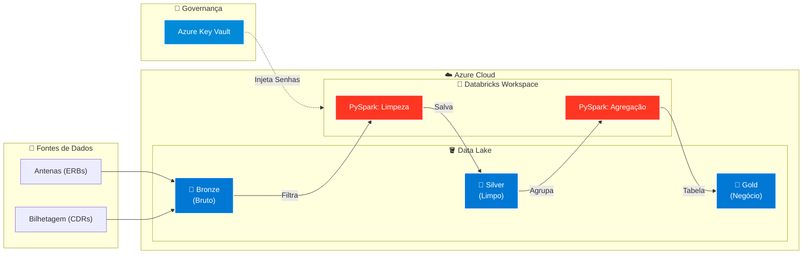

```mermaid
flowchart LR
    %% Definição de Cores
    classDef storage fill:#0078D4,stroke:#fff,stroke-width:2px,color:#fff;
    classDef compute fill:#FF3621,stroke:#fff,stroke-width:2px,color:#fff;
    classDef security fill:#008AD7,stroke:#fff,stroke-width:2px,color:#fff;

    subgraph Origem ["📡 Fontes de Dados"]
        A1["Antenas (ERBs)"]
        A2["Bilhetagem (CDRs)"]
    end

    subgraph Nuvem ["☁️ Azure Cloud"]
        subgraph ADLS ["🪣 Data Lake"]
            B["🥉 Bronze<br>(Bruto)"]:::storage
            S["🥈 Silver<br>(Limpo)"]:::storage
            G["🥇 Gold<br>(Negócio)"]:::storage
        end

        subgraph Processamento ["🧠 Databricks Workspace"]
            SP1["PySpark: Limpeza"]:::compute
            SP2["PySpark: Agregação"]:::compute
        end
    end

    subgraph Seguranca ["🔐 Governança"]
        KV["Azure Key Vault"]:::security
    end

    A1 --> B
    A2 --> B
    B -->|Filtra| SP1
    SP1 -->|Salva| S
    S -->|Agrupa| SP2
    SP2 -->|Tabela| G

    KV -.->|Injeta Senhas| Processamento
```